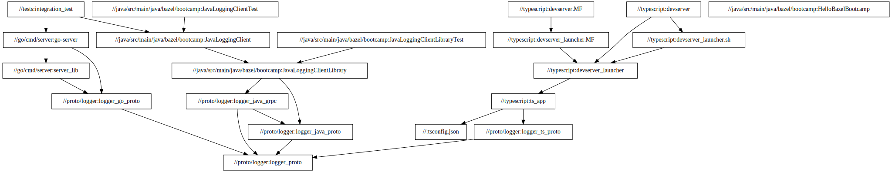

# Dependency graph of a Bazel packages

To list all the dependencies of the Go server package,
one has to write:
```
bazel query "deps(//go/cmd/server:go-server)"
```

And to list the dependencies of all the packages in the current workspace, one writes:
```
bazel query "deps(//...)"
```

To get it as a dot file, one has to add the option `--output=graph`.
The result of the command
```
bazel query "deps(//...)" --output=graph
```
is a 3500 lines dot file featuring 1028 nodes.
This graph is very large and hard to visualise.

We might prefer to only see the dependencies between the targets we wrote during this tutorial.
To do so, rather than `deps`, we will use another kind of query `allpaths`.
`allpaths` only displays the dependency chain betweeen 2 packages.

For instance, to understand how our java client depends on the Java GRPC packages, one can run
```
bazel query "allpaths(//java/src/main/java/bazel/bootcamp:JavaLoggingClient, @grpc-java//...)" --output=graph
```

Hence, to see the dependencies between the packages we just wrote,
one can do:
```
bazel query "allpaths(//..., //...)" --output=graph | dot -Tsvg > solutions/dependency_graph/graph.svg
```

The dot file is [local_graph.dot](local_graph.dot).

And the result is:

